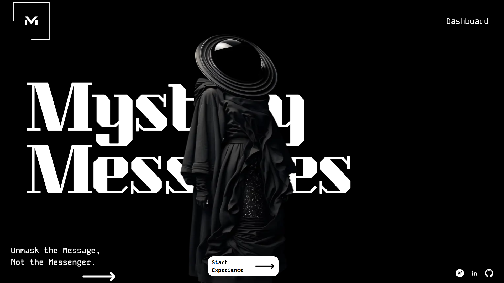
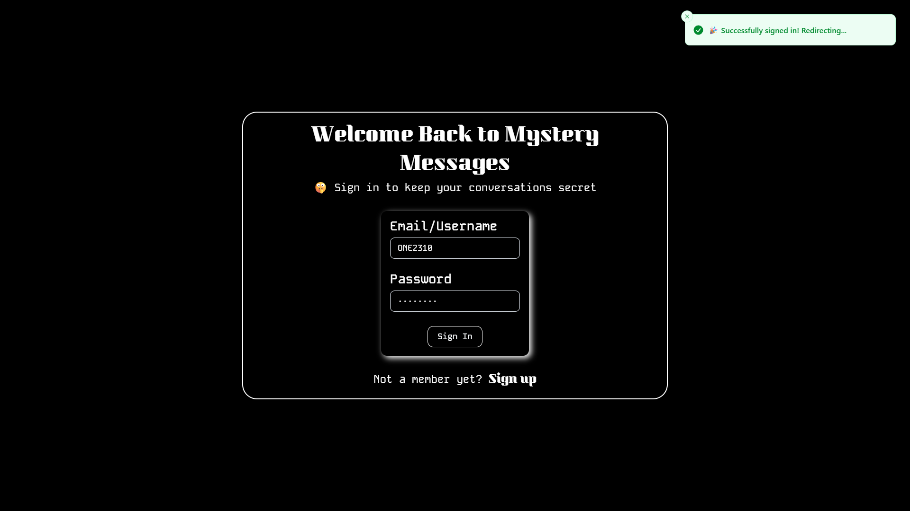
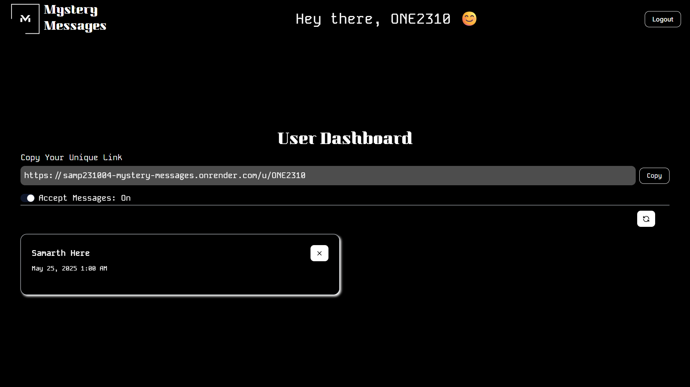
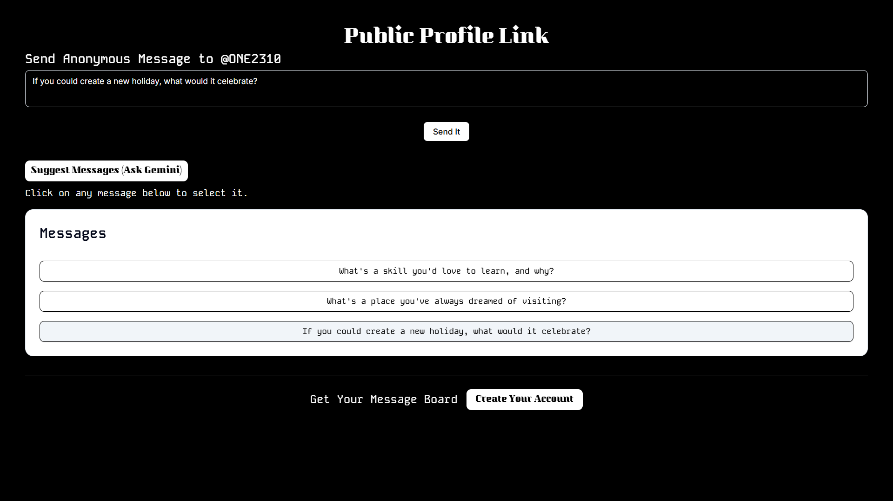
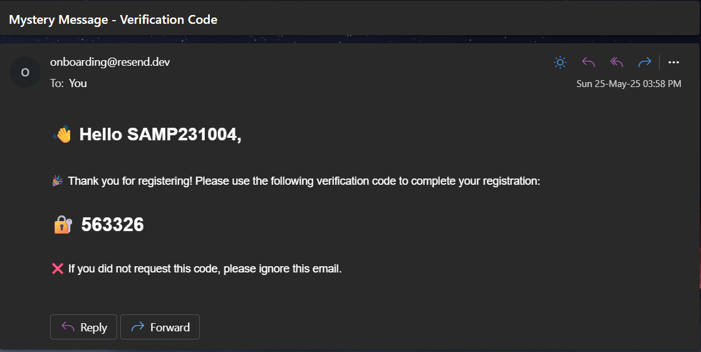
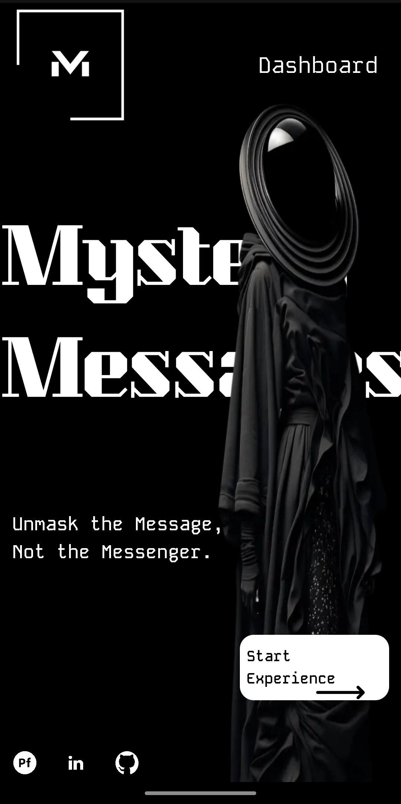
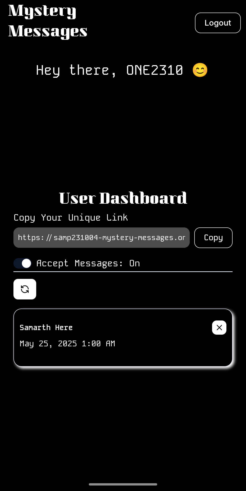
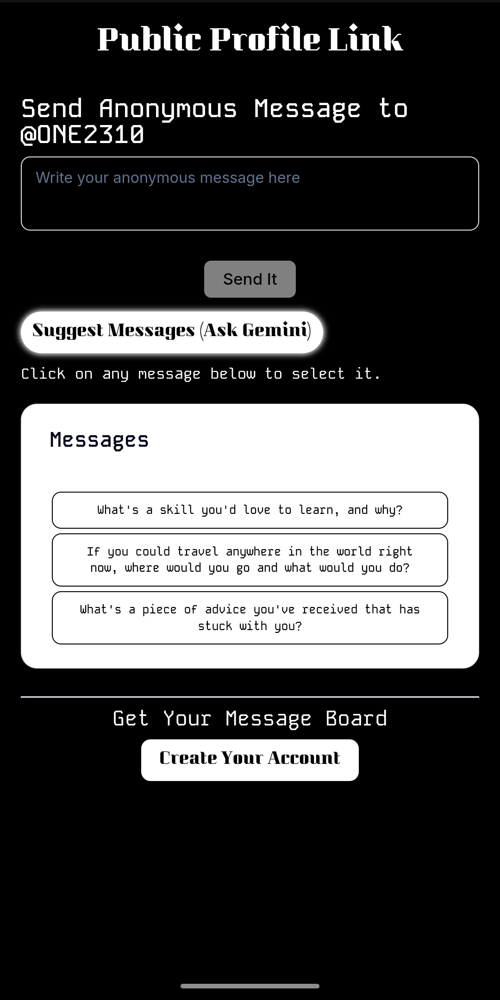

# 🕵️ Mystery Messages: Anonymous AI-Powered Messaging

**Mystery Messages** is your go-to platform for sending anonymous messages with a truly unique twist. Harnessing the power of **Gemini AI**, it helps you craft clever and thoughtful messages that spark intrigue. Built with a cutting-edge tech stack, this platform prioritizes performance and delivers an eye-catching user experience.

🌐 **Live Site**: [https://samp231004-mystery-messages.onrender.com](https://samp231004-mystery-messages.onrender.com)

---

## ✨ Features

* **🔒 Secure User Authentication**: **NextAuth.js** and **bcryptjs** are used to keep your account safe.
* **✅ Verified Email**: Get peace of mind with email verification powered by **Resend** and **react-email**.
    * *Note*: Due to `Resend.com`'s current limitations for personal use, the verification code is delivered to my personal email address. This means the verification process itself cannot be fully demonstrated live.
* **🤖 Gemini AI Integration**: Stumped for words? Integrated **Gemini AI** helps you generate mysterious and engaging message ideas.
* **✍️ Send & Receive Anonymous Messages**: Connect with others without revealing your identity.
* **📬 Personalized Message Inbox**: Easily view all the anonymous messages sent to your profile.
* **🔍 Speedy Search**: Find messages fast with a **debounced search input** (thanks to `usehooks-ts`).
* **📦 Optimized Data Querying**: Powered by a robust **MongoDB Aggregation Pipeline** for lightning-fast data retrieval.
* **⚙️ Type-Safe & Validated**: Developed with **TypeScript** and **ZOD** for robust schema validation.
* **💬 Instant Notifications**: Stay updated with **toast notifications** featuring engaging emojis for all interactions! 🚀
* **🌈 Responsive & Modern UI**: Enjoy a seamless experience on any device, crafted with **Shadcn/UI** and custom animations for a truly eye-popping design.

---

## 🛠️ Tech Stack

| Category           | Tools/Libraries                                           |
| :----------------- | :-------------------------------------------------------- |
| **Frontend** | Next.js, TypeScript, Tailwind CSS, Shadcn/UI, React       |
| **Backend** | Next.js API routes, MongoDB (Mongoose + Aggregation Pipeline) |
| **Authentication** | NextAuth.js, bcryptjs                                     |
| **Email** | Resend, react-email                                       |
| **Validation** | ZOD                                                       |
| **AI Integration** | Gemini AI, OpenAI API                                     |
| **Utilities** | usehooks-ts (debounce), react-hot-toast                   |
| **Hosting** | Render                                                    |

---

## 📸 Screenshots

Explore the sleek design of Mystery Messages across different devices:

---

### 💻 DESKTOP VIEW: A Detailed Look

Here's a comprehensive look at the Mystery Messages interface on larger screens, showcasing its full design and functionality.

**Aesthetic Landing Page:** Experience the eye-catching design of the homepage, inviting users into the world of anonymous messaging.

**Secure Sign-In:** A clear and intuitive interface for users to securely log into their accounts.

**User Dashboard:** Your personalized hub, displaying all messages received and options to compose new ones.

**Public Profile & Anonymous Sending:** This page allows others to send you anonymous messages, with **Gemini AI** offering clever suggestions to help them craft their note.

**Email Verification Code:** A glimpse at the verification code delivery, essential for securing user accounts.

---

### 📱 MOBILE VIEW: Perfectly Responsive

The design shines on smaller screens too! Key features are optimized for a smooth and engaging mobile experience.

  
  
  

---