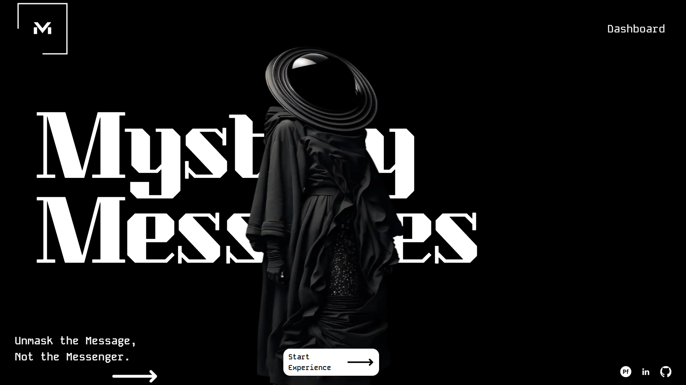
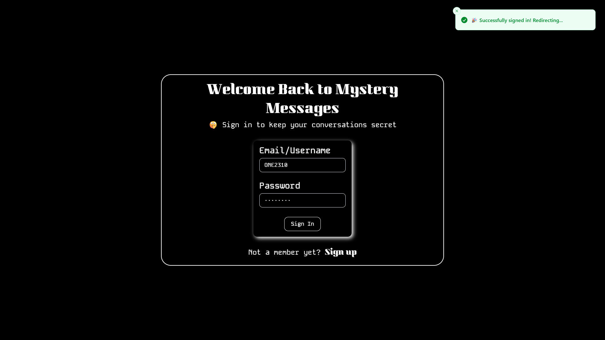
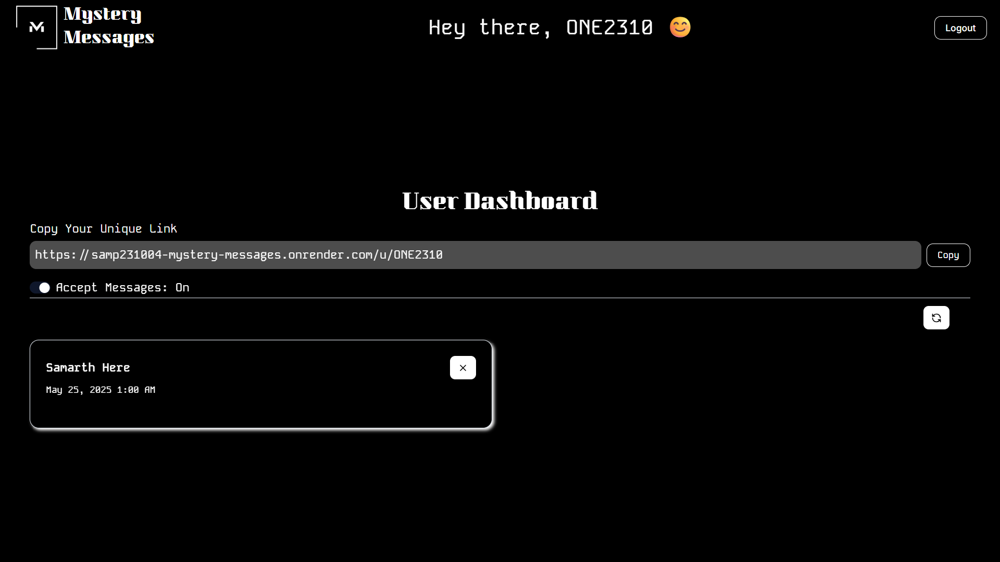
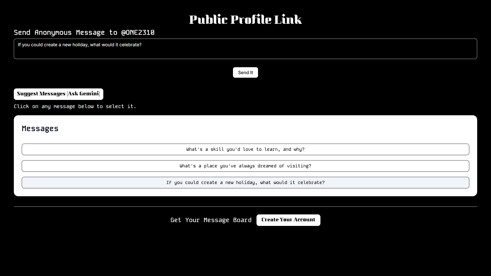
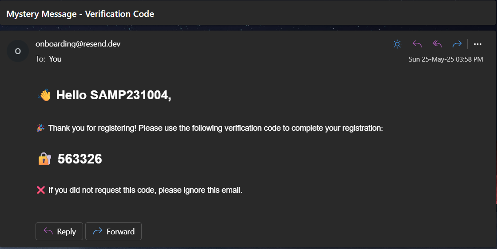
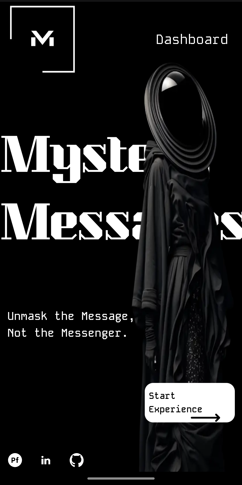
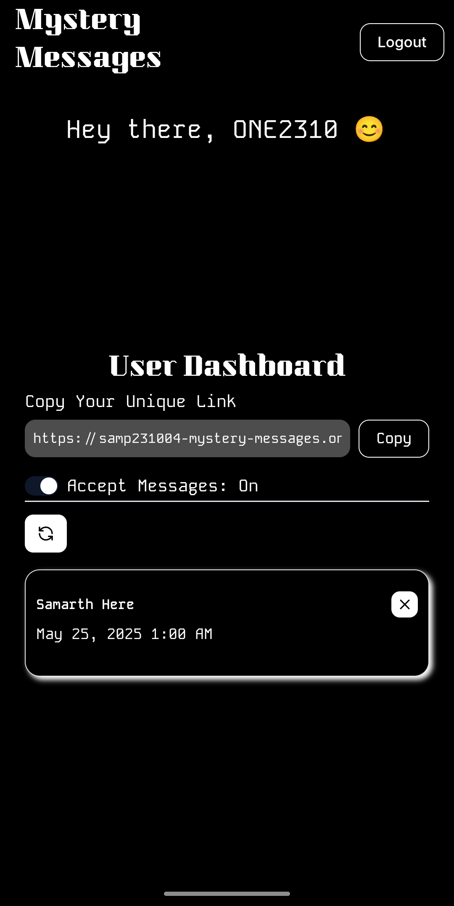
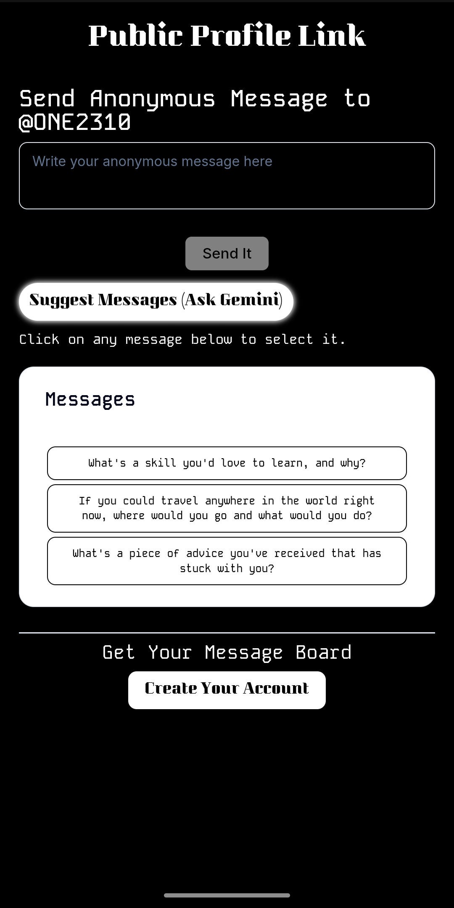

# 🕵️ Mystery Messages: Anonymous AI-Powered Messaging

**Mystery Messages** is a full-stack anonymous messaging platform where users can send and receive messages without revealing their identity. Integrated with **Gemini AI**, the application helps users generate creative and thoughtful message suggestions. This version features a modern **Next.js frontend** powered by a robust **Java Spring Boot backend**, combining an engaging user experience with a scalable and production-ready architecture.

🌐 **Live Site**: [https://samp231004-mystery-messages.onrender.com](https://samp231004-mystery-messages.onrender.com)

---

## ✨ Features

* **🔒 Secure User Authentication**: Built with **Spring Security**, **JWT**, and **BCrypt** to ensure secure user registration and login.
* **✅ Verified Email**: Email verification is handled through the **Resend API**, integrated directly into the Spring Boot backend.
    * *Note*: Due to `Resend.com`'s limitations for personal accounts, verification emails are currently delivered to my personal inbox, so the full verification flow may not be demonstrable on the live site.
* **🤖 Gemini AI Integration**: The backend connects to **Gemini API** to generate mysterious and engaging message suggestions for users.
* **✍️ Send & Receive Anonymous Messages**: Users can share messages anonymously without exposing their identity.
* **📬 Personalized Message Inbox**: Each user has a private dashboard to view all received messages.
* **🔍 Speedy Search**: Includes a **debounced search input** using `usehooks-ts` for efficient filtering.
* **📦 Optimized Data Retrieval**: Uses **MongoDB Aggregation Pipelines** for high-performance querying and message retrieval.
* **⚙️ Type-Safe & Validated**: Frontend validation is powered by **TypeScript** and **Zod**, while backend validation is handled using Spring's validation framework.
* **💬 Instant Notifications**: Interactive **toast notifications** provide immediate feedback for all user actions. 🚀
* **🌈 Responsive & Modern UI**: Designed with **Tailwind CSS** and **shadcn/ui** to deliver a polished experience across all devices.
* **🔄 Seamless API Routing**: The frontend continues using `/api/*` endpoints, which are transparently rewritten in `next.config.ts` to the Spring Boot backend.

---

## 🛠️ Tech Stack

| Category | Tools/Libraries |
| :------- | :-------------- |
| **Frontend** | Next.js 15, React 19, TypeScript, Tailwind CSS, shadcn/ui |
| **Backend** | Java 21, Spring Boot 3, Maven |
| **Database** | MongoDB |
| **Authentication** | Spring Security, JWT, BCrypt |
| **Email** | Resend API |
| **Validation** | Zod, Spring Validation |
| **AI Integration** | Gemini API |
| **Utilities** | usehooks-ts, react-hot-toast |
| **Hosting** | Render |

---

## 🏗️ Architecture Overview

The application follows a decoupled architecture where the **Next.js frontend** handles the user interface, while the **Spring Boot backend** manages authentication, business logic, email delivery, and AI integrations.

The frontend still calls familiar endpoints such as `/api/sign-up` and `/api/get-messages`. In this branch, these requests are automatically rewritten via `next.config.ts` to the Spring Boot backend, allowing the frontend to remain unchanged while benefiting from a more scalable backend architecture.

---

## 📁 Project Structure

```text
.
├── backend/                 # Spring Boot REST API
│   ├── pom.xml
│   └── src/main/java/com/mysterymessages/api
├── src/                     # Next.js frontend
│   ├── app
│   ├── components
│   ├── context
│   ├── schemas
│   └── types
└── package.json
````

> The original Next.js API routes, Mongoose models, NextAuth configuration, and React Email templates have been removed from this branch, as these responsibilities are now fully handled by the Spring Boot backend.

---

## 📸 Screenshots

Explore the sleek design of Mystery Messages across different devices:

---

### 💻 DESKTOP VIEW: A Detailed Look

Here's a comprehensive look at the Mystery Messages interface on larger screens, showcasing its full design and functionality.

**Aesthetic Landing Page:** Experience the eye-catching design of the homepage, inviting users into the world of anonymous messaging.

[](ScreenShots/SS_1.png)

**Secure Sign-In:** A clean and intuitive interface for users to securely access their accounts.

[](ScreenShots/SS_2.png)

**User Dashboard:** A personalized hub displaying all received anonymous messages and management options.

[](ScreenShots/SS_3.png)

**Public Profile & Anonymous Sending:** Others can send you anonymous messages, with **Gemini AI** generating creative suggestions to inspire them.

[](ScreenShots/SS_4.png)

**Email Verification Code:** A glimpse of the verification email used to confirm new accounts.

[](ScreenShots/SS_8.png)

---

### 📱 MOBILE VIEW: Perfectly Responsive

The design is fully optimized for mobile devices, ensuring a smooth and engaging experience on smaller screens.

<p align="center">
  
  
  
</p>

---